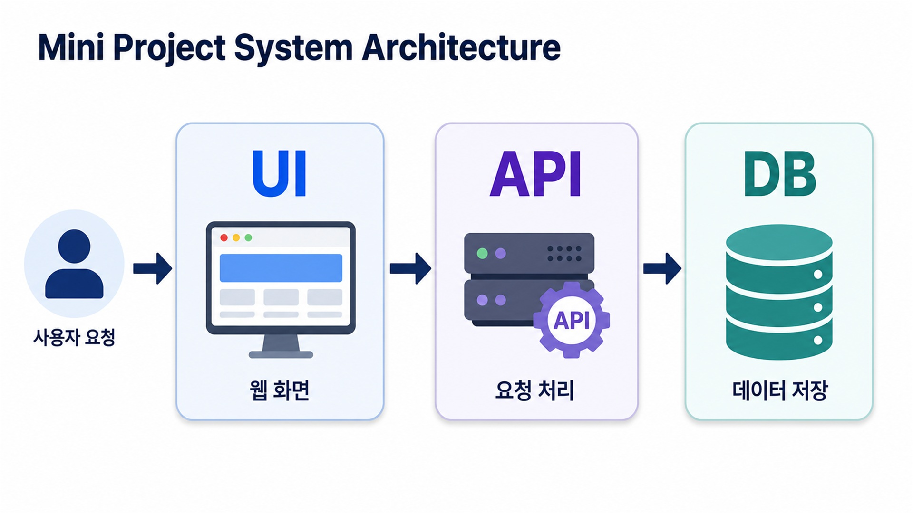

# 공공임대 청약 통합 안내 서비스

공공임대·분양 청약 공고를 한곳에서 조회하고, 즐겨찾기와 주변 생활권 분석, AI 상담을 이용할 수 있는 웹 서비스입니다.

관리자는 별도의 관리자 화면에서 공고와 이미지를 관리하고, 즐겨찾기 순위와 서비스 로그를 확인할 수 있습니다.

## 서비스 구조



```text
사용자·관리자
    ↓
UI — Streamlit
    ↓ HTTP 요청
API — FastAPI
    ↓ 데이터 처리
DB — Supabase
    ↓ 조회 결과
API → UI 화면 표시
```

### UI → API → DB 예시

사용자가 청약 공고의 즐겨찾기 버튼을 누르면 다음 순서로 처리됩니다.

1. `FE_User`의 Streamlit 화면이 즐겨찾기 등록을 요청합니다.
2. `BE`의 FastAPI가 `POST /favorites/create` 요청을 처리합니다.
3. Supabase의 `favorites` 테이블에 사용자 ID와 공고 ID를 저장합니다.
4. 처리 결과를 FastAPI가 반환하면 Streamlit 화면에 표시합니다.


## 주요 기능

- 사용자 회원가입·로그인과 프로필 관리
- 청약 공고 조회·검색·정렬
- 즐겨찾기 등록·조회·삭제
- 공고 위치와 주변 지하철·마트·병원 조회
- AI 상담과 사이트 이용 안내
- 관리자 공고·이미지 관리
- 즐겨찾기 순위와 서비스 로그 조회

## 기술 스택

| 구분 | 기술 |
|---|---|
| UI | Streamlit |
| API | FastAPI, Pydantic |
| DB·인증·Storage | Supabase |
| AI | Gemini |
| 대화 임시 저장 | Redis |
| 위치 검색 | Kakao Local API |

## 프로젝트 구성

```text
aio-01-p1-team1/
├─ FE_User/     사용자용 Streamlit 앱
├─ FE_Admin/    관리자용 Streamlit 앱
├─ BE/          FastAPI 백엔드
└─ docs/        프로젝트 문서
```

자세한 구현 내용은 [프로젝트 계획서](docs/plan/plan.md)에서 확인할 수 있습니다.
