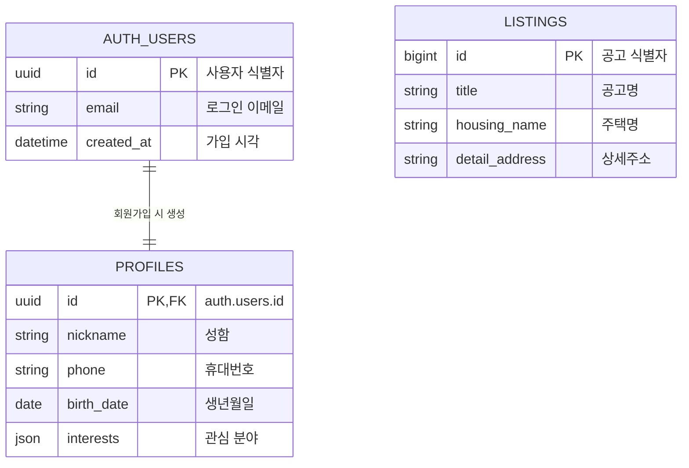
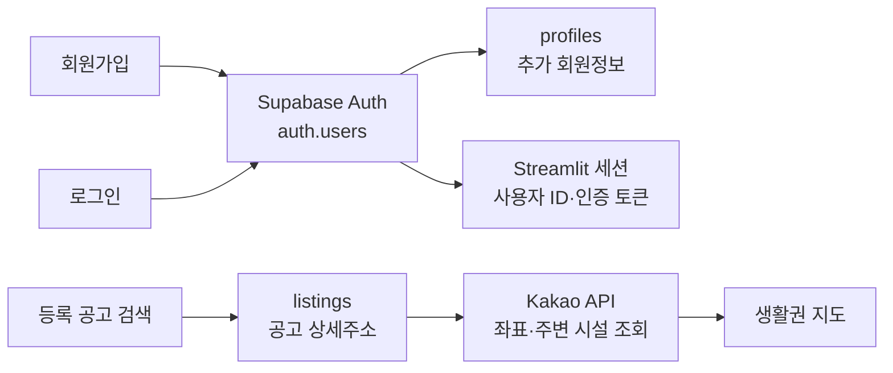

# 로그인·회원가입·주변생활권 분석 ERD

## 1. 간단 ERD

## 2. ERD 해석

- `auth.users`는 Supabase Auth가 관리하며 로그인 이메일과 인증 정보를 담당한다.
- 회원가입이 완료되면 같은 사용자 ID를 가진 `profiles` 행이 자동 생성된다.
- `profiles`에는 성함, 연락처, 생년월일, 관심 분야와 같은 서비스용 추가정보를 저장한다.
- 주변생활권 분석은 `listings`에 등록된 공고 중 하나를 선택하고 `detail_address`를 사용한다.
- `listings`는 로그인 정보와 직접 연결되지 않으므로 ERD에서도 관계선을 연결하지 않는다.
- Kakao API는 테이블이 아니라 공고 주소를 일시적으로 좌표로 변환하고 주변 시설을 조회하는 외부 서비스다.

## 3. 발표용 데이터 흐름

