# 1팀 화면설계서

## 1. 문서 개요

| 항목 | 내용 |
| --- | --- |
| 프로젝트명 | 공공임대 및 분양 청약 통합 안내 서비스 |
| 목적 | 관리자가 청약 공고를 관리하고, 사용자가 공고를 검색·즐겨찾기·생활권 분석할 수 있는 통합 서비스 제공 |
| 작성 기준 | `develop` 브랜치의 최신 구현 코드 |
| 프런트엔드 | Streamlit 사용자 앱(`FE_User`), Streamlit 관리자 앱(`FE_Admin`) |
| 백엔드 연동 | FastAPI REST API, Supabase PostgreSQL, Supabase Auth, Kakao Local API |
| 문서 범위 | 정보구조, 화면 흐름, 와이어프레임, 사용자 액션, API 호출, 정상·빈 데이터·오류 상태 |

이 문서는 교과목 프로젝트 가이드의 화면설계서 요구사항을 기준으로 팀 전체 화면을 정리한 현행 설계서다. 실제 구현과 차이가 확인된 항목은 문서 마지막의 구현 점검 사항에 별도로 기록한다.

---

## 2. 서비스 사용자와 핵심 목적

### 2.1 일반 사용자

- 이메일로 회원가입하고 로그인한다.
- 자치구와 금액 조건으로 청약 공고를 검색한다.
- 공고의 금액, 신청 기간, 상세 설명과 이미지를 확인한다.
- 관심 공고를 즐겨찾기에 저장하고 지도에서 위치를 확인한다.
- 선택한 공고 주변의 지하철역, 마트, 병원을 확인한다.
- 연락처, 관심 분야, 비밀번호를 관리한다.

### 2.2 관리자

- 사전에 발급된 계정으로 로그인한다.
- 청약 공고와 이미지를 등록·조회·수정·삭제한다.
- 즐겨찾기 순위와 사용자별 즐겨찾기 내역을 확인한다.
- 서비스의 최근 로그와 warning/error 이력을 모니터링한다.

---

## 3. 전체 정보구조

#### 서비스 진입 구조

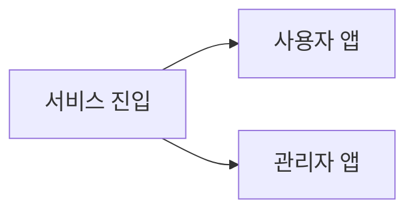
```mermaid
%%{init: {"themeVariables": {"fontSize": "19px"}, "flowchart": {"nodeSpacing": 45, "rankSpacing": 45}}}%%
flowchart LR
    S[서비스 진입] --> U[사용자 앱]
    S --> A[관리자 앱]
```

#### 사용자 앱 구조

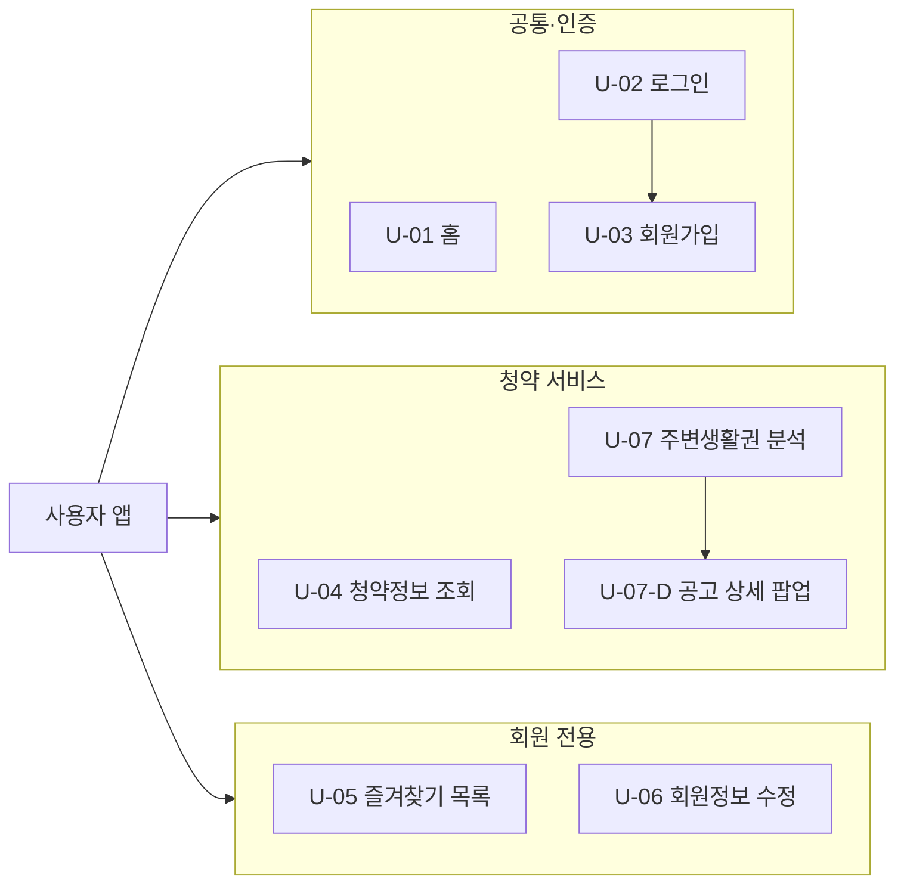
```mermaid
%%{init: {"themeVariables": {"fontSize": "19px"}, "flowchart": {"nodeSpacing": 45, "rankSpacing": 45}}}%%
flowchart LR
    U[사용자 앱]

    subgraph COMMON[공통·인증]
        direction TB
        U01[U-01 홈]
        U02[U-02 로그인] --> U03[U-03 회원가입]
    end

    subgraph LISTING[청약 서비스]
        direction TB
        U04[U-04 청약정보 조회]
        U07[U-07 주변생활권 분석] --> U07D[U-07-D 공고 상세 팝업]
    end

    subgraph MEMBER[회원 전용]
        direction TB
        U05[U-05 즐겨찾기 목록]
        U06[U-06 회원정보 수정]
    end

    U --> COMMON
    U --> LISTING
    U --> MEMBER
```

#### 관리자 앱 구조

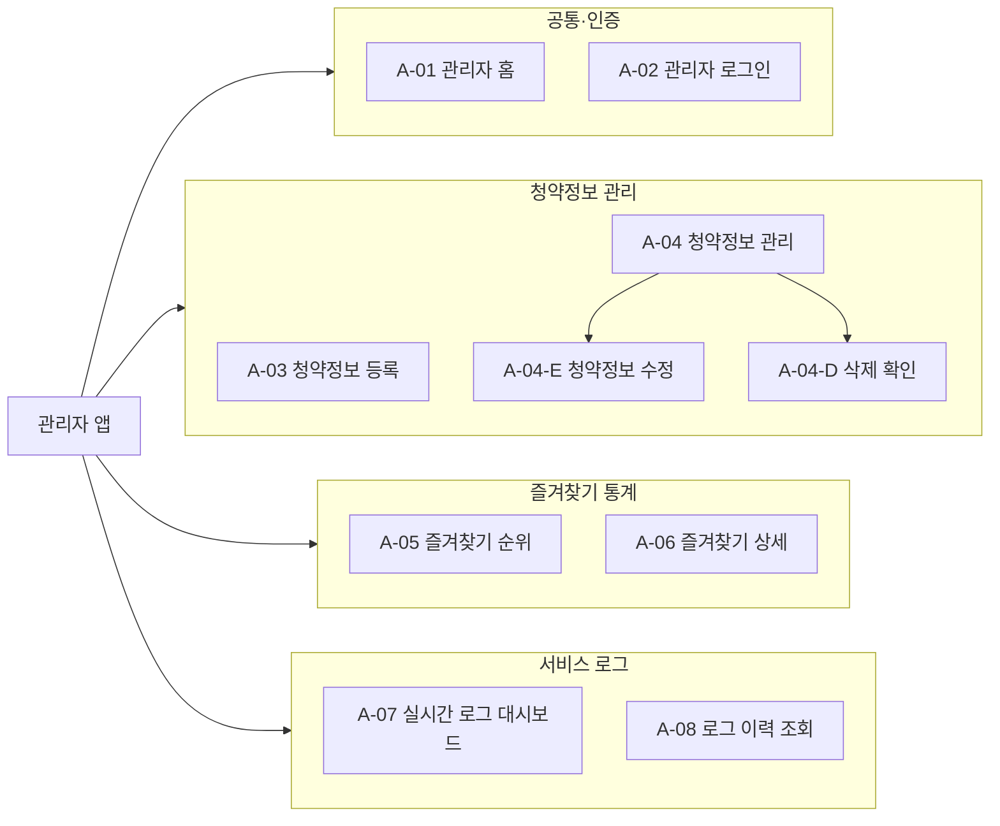
```mermaid
%%{init: {"themeVariables": {"fontSize": "19px"}, "flowchart": {"nodeSpacing": 45, "rankSpacing": 45}}}%%
flowchart LR
    A[관리자 앱]

    subgraph ACCESS[공통·인증]
        direction TB
        A01[A-01 관리자 홈]
        A02[A-02 관리자 로그인]
    end

    subgraph MANAGE[청약정보 관리]
        direction TB
        A03[A-03 청약정보 등록]
        A04[A-04 청약정보 관리]
        A04 --> A04E[A-04-E 청약정보 수정]
        A04 --> A04D[A-04-D 삭제 확인]
    end

    subgraph STATS[즐겨찾기 통계]
        direction TB
        A05[A-05 즐겨찾기 순위]
        A06[A-06 즐겨찾기 상세]
    end

    subgraph LOGS[서비스 로그]
        direction TB
        A07[A-07 실시간 로그 대시보드]
        A08[A-08 로그 이력 조회]
    end

    A --> ACCESS
    A --> MANAGE
    A --> STATS
    A --> LOGS
```

### 3.1 접근 권한

| 구분 | 공개 화면 | 로그인 필요 화면 |
| --- | --- | --- |
| 사용자 | 홈, 로그인, 회원가입, 청약정보 조회, 주변생활권 분석 | 즐겨찾기 목록, 회원정보 수정, 즐겨찾기 추가 |
| 관리자 | 관리자 홈, 관리자 로그인 | 청약 등록·관리, 즐겨찾기 통계, 로그 화면 전체 |

### 3.2 공통 내비게이션

- 데스크톱: 화면 왼쪽 고정 사이드바, 오른쪽 본문 영역.
- 사용자 비로그인: 홈, 청약정보 조회, 주변생활권 분석, 로그인.
- 사용자 로그인: 즐겨찾기, My Page, 이메일 표시, 로그아웃 추가.
- 관리자 비로그인: 홈, 로그인.
- 관리자 로그인: 공고 등록·관리, 즐겨찾기 통계, 로그 메뉴, 계정 표시, 로그아웃 추가.
- 새로고침 시 브라우저 Session Storage의 로그인 정보를 읽어 세션을 복원한다.

---

## 4. 공통 디자인 시스템

현재 프로젝트는 별도 테마 파일 없이 Streamlit 기본 테마를 사용한다. 아래 항목은 현재 화면에서 공통으로 적용되는 구성 원칙이다.

| 요소 | 설계 규칙 |
| --- | --- |
| 화면 제목 | 각 페이지 최상단에 `st.title`, 화면당 1개 |
| 보조 설명 | 제목 아래 `st.caption`으로 기능과 사용법 안내 |
| 주요 버튼 | 등록·로그인·탐색·저장에 `type="primary"` 사용 |
| 보조 버튼 | 취소·초기화·이동·삭제 준비는 기본 버튼 사용 |
| 입력 영역 | 관련 입력을 `st.form`, `st.expander`, `st.columns`로 그룹화 |
| 카드 | 공고 목록은 테두리가 있는 컨테이너로 구분 |
| 데이터 표 | 관리자 통계와 로그는 전체 너비 데이터프레임 사용 |
| 성공 | `st.success` 또는 `st.info`로 완료 메시지 표시 |
| 경고 | 미로그인, 입력 누락, 복구 불가 작업은 `st.warning` 표시 |
| 오류 | API 실패·검증 실패·조회 실패는 `st.error` 표시 |
| 로딩 | 네트워크 호출 중 `st.spinner` 표시 |
| 빈 데이터 | 빈 화면 대신 “조회된 정보가 없습니다” 안내 표시 |
| 위험 작업 | 삭제 전 체크박스 또는 확인 팝업 제공 |

### 4.1 권장 일관성 기준

권장 일관성 기준은 여러 화면에서 같은 역할을 하는 요소가 같은 모양, 용어, 위치와 반응을 갖도록 정한 공통 규칙이다. 사용자가 화면마다 조작법을 다시 익히지 않게 하고, 팀원이 서로 다른 페이지를 개발해도 하나의 서비스처럼 보이게 하는 것이 목적이다.

- 입력 폼의 주요 버튼은 전체 너비로 통일한다.
- 같은 의미의 용어는 사용자 화면 전체에서 동일하게 쓴다. 예: `월세` 또는 `월 임대료` 중 하나.
- 사용자 메뉴와 관리자 메뉴 모두 페이지 아이콘 표시 여부를 통일한다.
- 모바일에서는 여러 열을 세로로 쌓고, 표는 가로 스크롤을 허용한다.
- 색상만으로 상태를 구분하지 않고 상태 문구를 함께 표시한다.
- 로그인·가입·검색·등록·수정처럼 작업 순서가 중요한 핵심 화면은 흐름형 도식을 사용한다.
- 홈·목록·통계·로그처럼 구성 확인이 중요한 단순 화면은 계층형 도식을 사용한다.
- 도식은 색상에 의존하지 않고 화면명, 입력, 결과, 액션 문구로 구조를 구분한다.

---

## 5. 사용자 앱 화면 목록

| ID | 화면 | 핵심 기능 | 주요 연동 |
| --- | --- | --- | --- |
| U-01 | 홈 | 서비스 안내, 로그인 상태 안내 | Session Storage |
| U-02 | 로그인 | 이메일 로그인, 회원가입 이동 | Supabase Auth |
| U-03 | 회원가입 | 약관 동의, 사용자 정보 등록 | Supabase Auth, profiles |
| U-04 | 청약정보 조회 | 검색, 정렬, 상세, 즐겨찾기, 페이지 이동 | listings, favorites API |
| U-05 | 즐겨찾기 목록 | 저장 공고 조회·삭제, 지도 표시 | favorites API, Kakao API |
| U-06 | 회원정보 수정 | 프로필·관심 분야·비밀번호 수정 | profiles API, Supabase Auth |
| U-07 | 주변생활권 분석 | 공고 검색, 반경 설정, 주변 시설 지도 | listings API, Kakao API |
| U-07-D | 공고 상세 팝업 | 선택 공고 상세정보와 원문 링크 | 선택 공고 데이터 재사용 |

---

## 6. 사용자 앱 상세 화면

### U-01. 사용자 홈

**사용자 목적:** 서비스의 용도와 다음 행동을 빠르게 이해한다.

**화면 구성:**

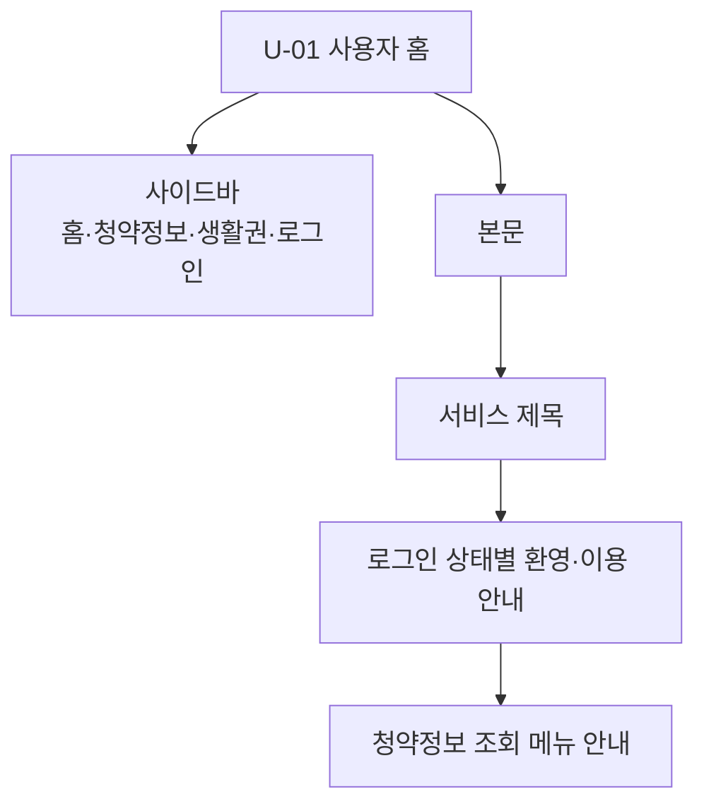
```mermaid
%%{init: {"themeVariables": {"fontSize": "19px"}, "flowchart": {"nodeSpacing": 45, "rankSpacing": 45}}}%%
flowchart TB
    TITLE[U-01 사용자 홈]
    NAV[사이드바<br/>홈·청약정보·생활권·로그인]
    CONTENT[본문]
    SERVICE[서비스 제목]
    GUIDE[로그인 상태별 환영·이용 안내]
    NEXT[청약정보 조회 메뉴 안내]

    TITLE --> NAV
    TITLE --> CONTENT
    CONTENT --> SERVICE --> GUIDE --> NEXT
```

| 상태/액션 | 시스템 반응 | 사용자 피드백 |
| --- | --- | --- |
| 최초 진입 | 홈 내용을 표시 | 서비스 이용 안내 |
| 로그인 상태 | 세션의 이메일을 확인 | 사용자 환영 메시지 |
| 비로그인 상태 | 공개 메뉴만 표시 | 로그인 시 즐겨찾기 관리 가능 안내 |
| 세션 복원 중 | Session Storage 조회 | “로그인 상태를 확인하는 중” 표시 |
| 세션 만료 | 저장 토큰 삭제 | 재로그인 경고 |

### U-02. 로그인

**사용자 목적:** 가입한 이메일과 비밀번호로 서비스에 로그인한다.

**화면 구성:**

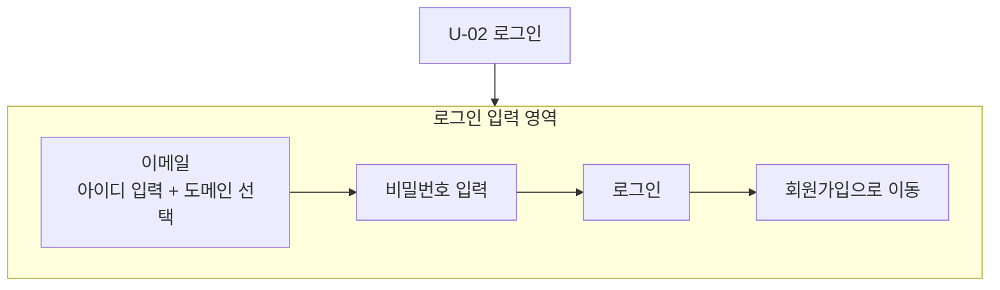
```mermaid
%%{init: {"themeVariables": {"fontSize": "19px"}, "flowchart": {"nodeSpacing": 45, "rankSpacing": 45}}}%%
flowchart TB
    TITLE[U-02 로그인]

    subgraph FORM[로그인 입력 영역]
        EMAIL[이메일<br/>아이디 입력 + 도메인 선택]
        PASSWORD[비밀번호 입력]
        LOGIN[로그인]
        SIGNUP[회원가입으로 이동]

        EMAIL --> PASSWORD
        PASSWORD --> LOGIN
        LOGIN --> SIGNUP
    end

    TITLE --> FORM
```

| 사용자 액션 | 시스템 반응 | 성공/실패 피드백 |
| --- | --- | --- |
| 도메인 선택 | 이메일 아이디와 도메인을 결합 | 선택값 유지 |
| 로그인 클릭 | Supabase Auth 로그인 요청 | 성공 시 세션 저장, 실패 시 401 안내 |
| 회원가입 클릭 | U-03으로 이동 | 회원가입 화면 표시 |
| 빈 값 제출 | API 호출 전 검증 | 입력 항목별 오류 문구 |

### U-03. 회원가입

**사용자 목적:** 필수 약관에 동의하고 서비스 계정을 생성한다.

**화면 구성:**

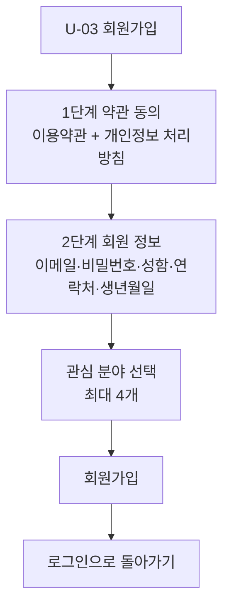
```mermaid
%%{init: {"themeVariables": {"fontSize": "19px"}, "flowchart": {"nodeSpacing": 45, "rankSpacing": 45}}}%%
flowchart TB
    TITLE[U-03 회원가입]
    TERMS[1단계 약관 동의<br/>이용약관 + 개인정보 처리방침]
    INFO[2단계 회원 정보<br/>이메일·비밀번호·성함·연락처·생년월일]
    INTEREST[관심 분야 선택<br/>최대 4개]
    JOIN[회원가입]
    BACK[로그인으로 돌아가기]

    TITLE --> TERMS
    TERMS --> INFO
    INFO --> INTEREST
    INTEREST --> JOIN
    JOIN --> BACK
```

| 사용자 액션 | 시스템 반응 | 성공/실패 피드백 |
| --- | --- | --- |
| 전체 동의 체크 | 두 필수 약관을 같은 상태로 변경 | 진행률 갱신 |
| 개별 약관 체크 | 전체 동의 상태 재계산 | 2개 동의 시 2단계 표시 |
| 관심 분야 선택 | 선택 목록 구성 | 4개 이후 미선택 항목 비활성화 |
| 회원가입 클릭 | 이메일·비밀번호·전화·날짜 검증 후 Supabase 가입 | 성공 안내 또는 항목별 오류 |
| 로그인으로 돌아가기 | U-02로 이동 | 로그인 화면 표시 |

### U-04. 청약정보 조회

**사용자 목적:** 조건에 맞는 공고를 비교하고 상세정보를 확인하거나 즐겨찾기에 저장한다.

**화면 구성:**

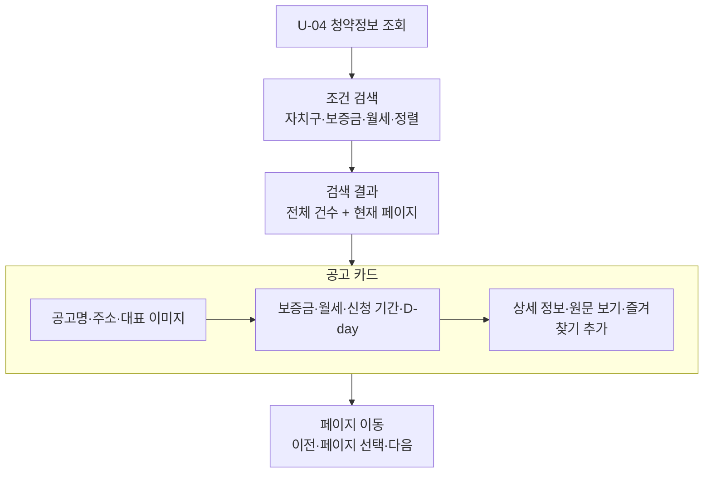
```mermaid
%%{init: {"themeVariables": {"fontSize": "19px"}, "flowchart": {"nodeSpacing": 45, "rankSpacing": 45}}}%%
flowchart TB
    TITLE[U-04 청약정보 조회]
    SEARCH[조건 검색<br/>자치구·보증금·월세·정렬]
    RESULT[검색 결과<br/>전체 건수 + 현재 페이지]

    subgraph CARD[공고 카드]
        SUMMARY[공고명·주소·대표 이미지]
        CONTRACT[보증금·월세·신청 기간·D-day]
        ACTION[상세 정보·원문 보기·즐겨찾기 추가]
        SUMMARY --> CONTRACT --> ACTION
    end

    PAGE[페이지 이동<br/>이전·페이지 선택·다음]

    TITLE --> SEARCH --> RESULT --> CARD --> PAGE
```

| 사용자 액션 | API/상태 변화 | 피드백 |
| --- | --- | --- |
| 기본 진입 | `GET /listings/getall?sort=` | 로딩, 전체 건수, 빈 데이터, API 오류 |
| 조건검색 | `GET /listings/search` | 검색 결과 수, 결과 없음을 표시 |
| 정렬 변경 후 검색 | 선택 정렬을 Session State에 저장 | 화면 재실행 후에도 정렬 유지 |
| 상세 정보 펼침 | 저장된 공고 데이터 사용 | 설명과 최대 20장 이미지 표시 |
| 원문 보기 | 외부 URL로 이동 | 새 페이지에서 원문 확인 |
| 즐겨찾기 추가 | `POST /favorites/create` | 성공 메시지, 중복·API 오류 |
| 페이지 이동 | URL의 `page` query parameter 변경 | 현재/전체 페이지 표시 |

### U-05. 즐겨찾기 목록

**사용자 목적:** 저장한 공고를 목록과 지도에서 확인하고 필요 없는 항목을 삭제한다.

**화면 구성:**

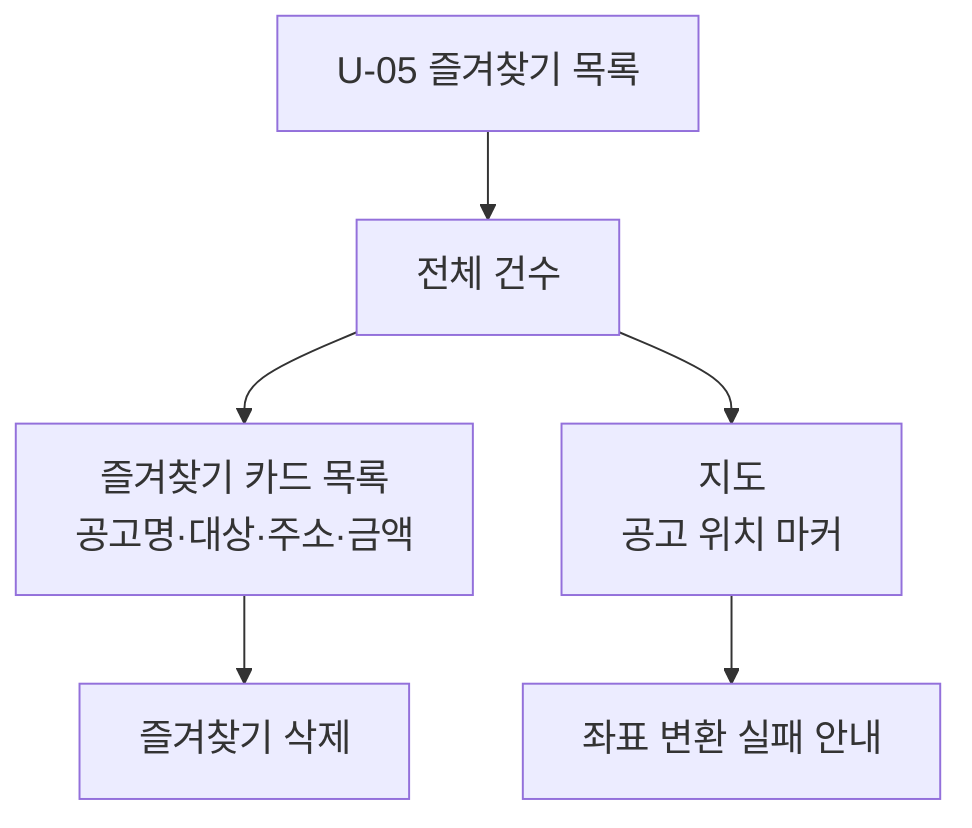
```mermaid
%%{init: {"themeVariables": {"fontSize": "19px"}, "flowchart": {"nodeSpacing": 45, "rankSpacing": 45}}}%%
flowchart TB
    TITLE[U-05 즐겨찾기 목록]
    COUNT[전체 건수]
    LIST[즐겨찾기 카드 목록<br/>공고명·대상·주소·금액]
    DELETE[즐겨찾기 삭제]
    MAP[지도<br/>공고 위치 마커]
    FAIL[좌표 변환 실패 안내]

    TITLE --> COUNT
    COUNT --> LIST --> DELETE
    COUNT --> MAP --> FAIL
```

| 사용자 액션 | API/상태 변화 | 피드백 |
| --- | --- | --- |
| 화면 진입 | `GET /favorites/mypage/{user_id}` | 총 건수 또는 빈 목록 안내 |
| 지도 표시 | 주소 좌표 변환 후 지도 생성 | 키 누락, 좌표 실패, 표시 불가 안내 |
| 삭제 클릭 | `DELETE /favorites/delete/{user_id}/{listing_id}` | 삭제 메시지 후 목록 새로고침 |
| 비로그인 접근 | 처리 중단 | 로그인 필요 경고 |

### U-06. 회원정보 수정

**사용자 목적:** 프로필과 관심 분야, 비밀번호를 변경한다.

**화면 구성:**

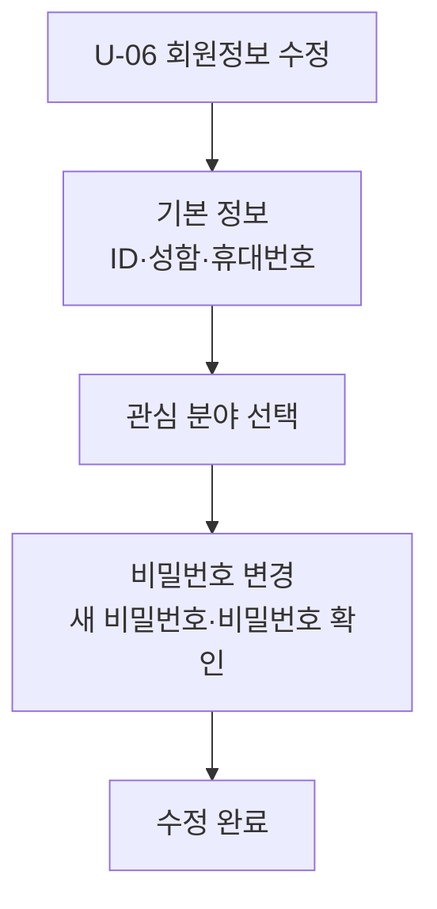
```mermaid
%%{init: {"themeVariables": {"fontSize": "19px"}, "flowchart": {"nodeSpacing": 45, "rankSpacing": 45}}}%%
flowchart TB
    TITLE[U-06 회원정보 수정]
    PROFILE[기본 정보<br/>ID·성함·휴대번호]
    INTEREST[관심 분야 선택]
    PASSWORD[비밀번호 변경<br/>새 비밀번호·비밀번호 확인]
    SAVE[수정 완료]

    TITLE --> PROFILE --> INTEREST --> PASSWORD --> SAVE
```

| 사용자 액션 | API/상태 변화 | 피드백 |
| --- | --- | --- |
| 화면 진입 | `GET /profiles/{user_id}` | 저장된 프로필을 폼에 표시 |
| 프로필 변경 | `PUT /profiles/{user_id}` | 프로필 수정 완료 또는 API 오류 |
| 비밀번호 변경 | Supabase Auth 비밀번호 변경 | 완료 또는 인증 오류 |
| 변경 없이 제출 | API 호출 안 함 | 변경 내용 없음 경고 |
| 잘못된 입력 | 길이·일치·필수값 검증 | 항목별 경고 |

### U-07. 주변생활권 분석

**사용자 목적:** 청약 공고 주변의 교통·쇼핑·의료 시설을 확인한다.

**화면 구성:**

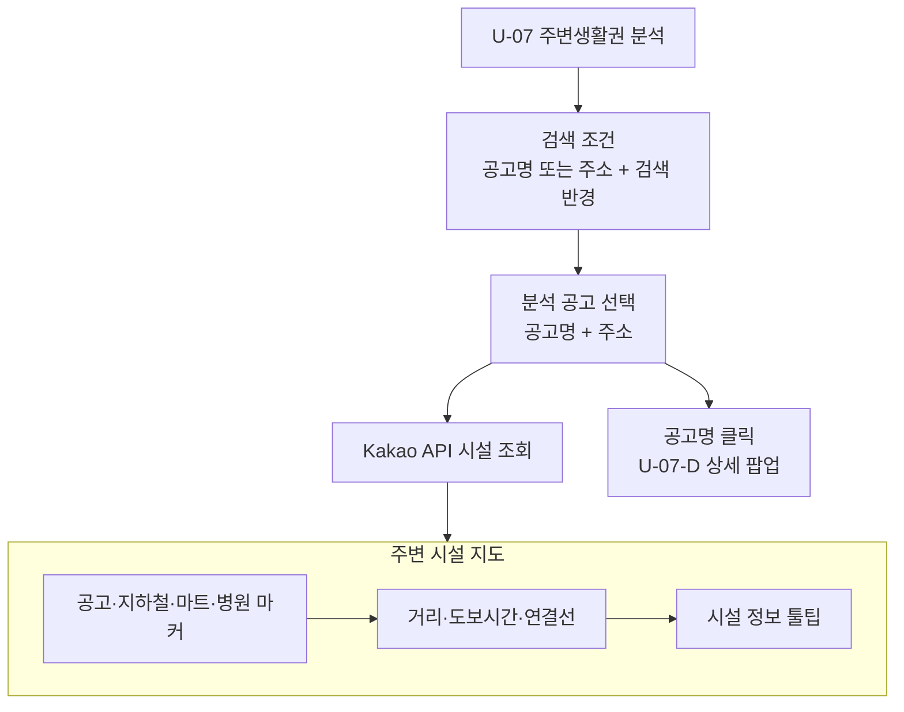
```mermaid
%%{init: {"themeVariables": {"fontSize": "19px"}, "flowchart": {"nodeSpacing": 45, "rankSpacing": 45}}}%%
flowchart TB
    TITLE[U-07 주변생활권 분석]
    SEARCH[검색 조건<br/>공고명 또는 주소 + 검색 반경]
    SELECT[분석 공고 선택<br/>공고명 + 주소]
    KAKAO[Kakao API 시설 조회]

    subgraph MAP[주변 시설 지도]
        MARKER[공고·지하철·마트·병원 마커]
        ROUTE[거리·도보시간·연결선]
        TOOLTIP[시설 정보 툴팁]
        MARKER --> ROUTE --> TOOLTIP
    end

    DETAIL[공고명 클릭<br/>U-07-D 상세 팝업]

    TITLE --> SEARCH --> SELECT --> KAKAO --> MAP
    SELECT --> DETAIL
```

| 사용자 액션 | API/상태 변화 | 피드백 |
| --- | --- | --- |
| 공고 검색 | `GET /listings/getall`, 화면에서 문자열 검색 | 로딩, 일치 없음, API 오류 |
| 공고 선택 | 선택 공고의 상세주소 사용 | 주소 없음 오류 |
| 좌표 조회 | `GET /locations/geocode?address=` | 좌표 조회 로딩, 조회 실패 오류 |
| 시설 조회 | `GET /locations/nearby-facilities` | 지도와 시설 아이콘 표시 |
| 아이콘 호버 | API 추가 호출 없음 | 시설명·종류·거리·도보시간 툴팁 |
| 공고명 클릭 | U-07-D 팝업 열기 | 선택 공고 상세정보 표시 |

#### U-07-D. 공고 상세 팝업

**화면 구성:**

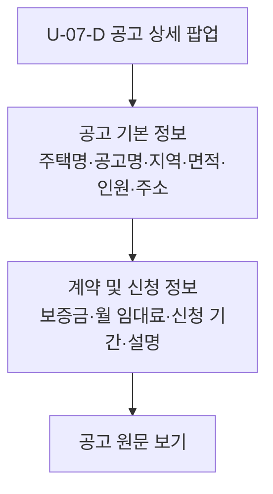
```mermaid
%%{init: {"themeVariables": {"fontSize": "19px"}, "flowchart": {"nodeSpacing": 45, "rankSpacing": 45}}}%%
flowchart TB
    TITLE[U-07-D 공고 상세 팝업]
    BASIC[공고 기본 정보<br/>주택명·공고명·지역·면적·인원·주소]
    CONTRACT[계약 및 신청 정보<br/>보증금·월 임대료·신청 기간·설명]
    ORIGINAL[공고 원문 보기]

    TITLE --> BASIC --> CONTRACT --> ORIGINAL
```

---

## 7. 관리자 앱 화면 목록

| ID | 화면 | 핵심 기능 | 주요 연동 |
| --- | --- | --- | --- |
| A-01 | 관리자 홈 | 로그인 상태와 메뉴 안내 | Session Storage |
| A-02 | 관리자 로그인 | 관리자 계정 확인 | `POST /admin/login` |
| A-03 | 청약정보 등록 | 공고 입력, 다중 이미지 업로드 | admin listings API |
| A-04 | 청약정보 관리 | 검색, 조회, 페이지 이동, 삭제 | listings, admin listings API |
| A-04-E | 청약정보 수정 | 공고 내용과 이미지 변경 | admin listings API |
| A-04-D | 삭제 확인 | 개별 이미지 또는 공고 삭제 확인 | DELETE API |
| A-05 | 즐겨찾기 순위 | 공고별 즐겨찾기 수 표 | admin favorites API |
| A-06 | 즐겨찾기 상세 | 사용자별 저장 내역과 ID 필터 | admin favorites API |
| A-07 | 실시간 로그 대시보드 | 최근 로그 표와 레벨 차트 | `GET /logs` |
| A-08 | 로그 이력 조회 | 저장된 warning/error 조회 | `GET /logs/history` |

---

## 8. 관리자 앱 상세 화면

### A-01~A-02. 관리자 홈과 로그인

**화면 구성:**

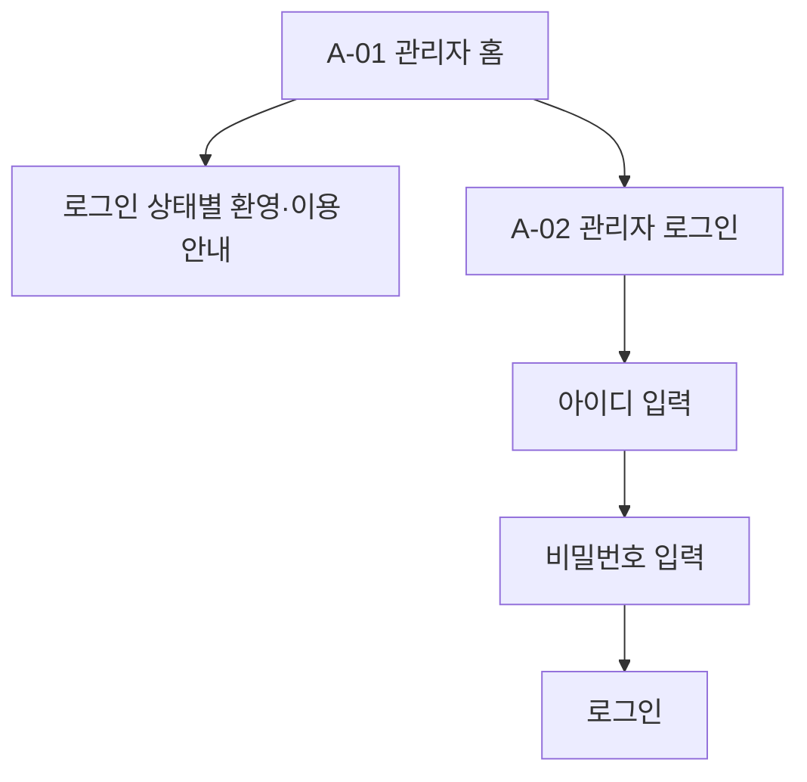
```mermaid
%%{init: {"themeVariables": {"fontSize": "19px"}, "flowchart": {"nodeSpacing": 45, "rankSpacing": 45}}}%%
flowchart TB
    HOME[A-01 관리자 홈]
    WELCOME[로그인 상태별 환영·이용 안내]
    LOGIN[A-02 관리자 로그인]
    ID[아이디 입력]
    PASSWORD[비밀번호 입력]
    SUBMIT[로그인]

    HOME --> WELCOME
    HOME --> LOGIN --> ID --> PASSWORD --> SUBMIT
```

| 사용자 액션 | 시스템 반응 | 피드백 |
| --- | --- | --- |
| 관리자 로그인 | `POST /admin/login` | 성공 시 관리자 메뉴 표시, 실패 시 오류 |
| 보호 화면 직접 접근 | 로그인 여부 검사 | 로그인 화면으로 전환 |
| 로그아웃 | 세션과 Session Storage 삭제 | 비로그인 메뉴로 전환 |

### A-03. 청약정보 등록

**화면 구성:**

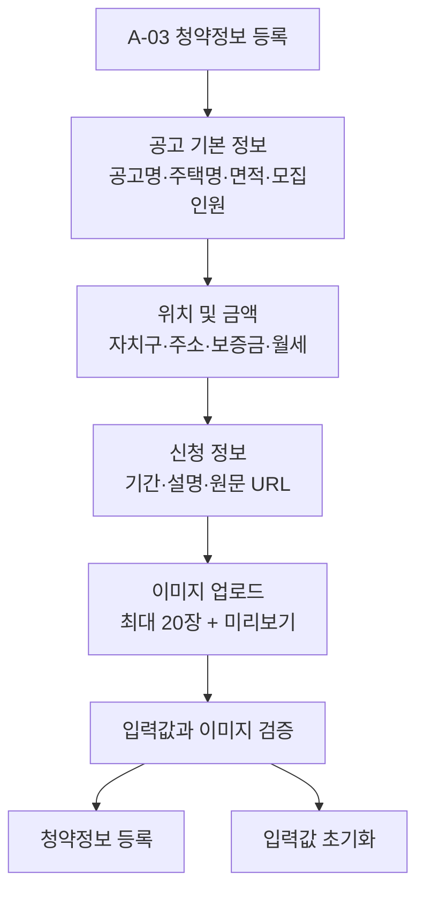
```mermaid
%%{init: {"themeVariables": {"fontSize": "19px"}, "flowchart": {"nodeSpacing": 45, "rankSpacing": 45}}}%%
flowchart TB
    TITLE[A-03 청약정보 등록]
    BASIC[공고 기본 정보<br/>공고명·주택명·면적·모집인원]
    CONTRACT[위치 및 금액<br/>자치구·주소·보증금·월세]
    PERIOD[신청 정보<br/>기간·설명·원문 URL]
    IMAGE[이미지 업로드<br/>최대 20장 + 미리보기]
    VALIDATE[입력값과 이미지 검증]
    CREATE[청약정보 등록]
    RESET[입력값 초기화]

    TITLE --> BASIC --> CONTRACT --> PERIOD --> IMAGE --> VALIDATE
    VALIDATE --> CREATE
    VALIDATE --> RESET
```

| 사용자 액션 | API/상태 변화 | 피드백 |
| --- | --- | --- |
| 이미지 선택 | 개수·개별 크기·전체 크기 검증 | 미리보기 또는 업로드 오류 |
| 등록 클릭 | 이미지 업로드 후 `POST /admin/listings/create` | 등록 성공 또는 입력/API 오류 |
| 초기화 클릭 | 입력 위젯 key 갱신 | 기본값으로 초기화 |
| 종료일 오류 | API 호출 전 날짜 비교 | 종료일 경고 |

### A-04. 청약정보 관리

**화면 구성:**

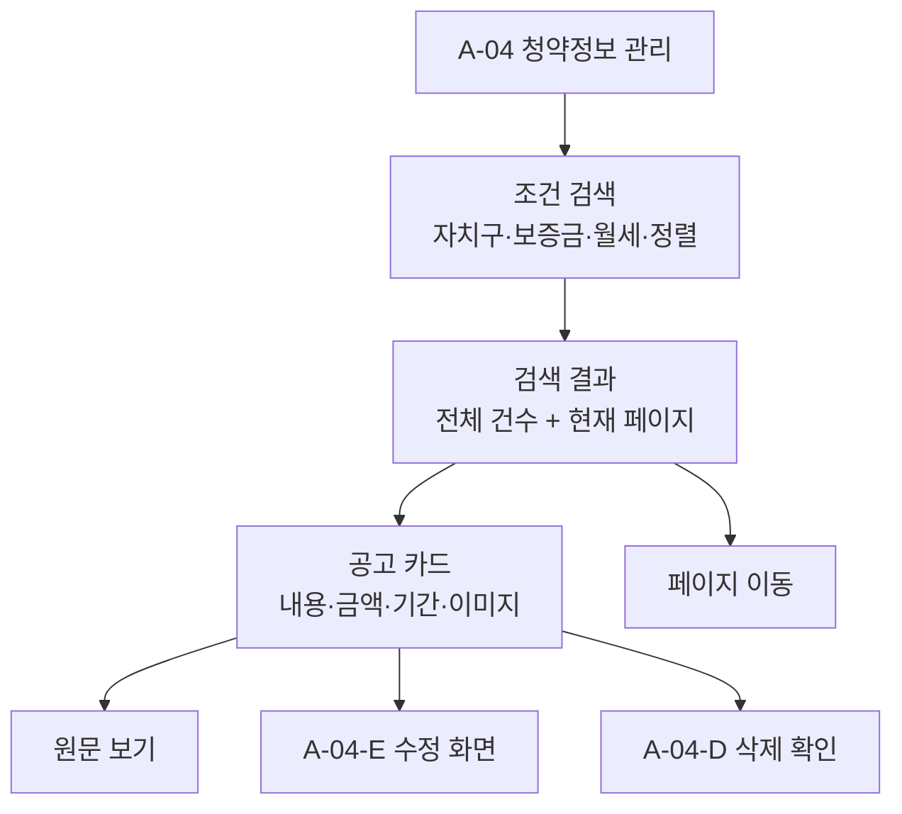
```mermaid
%%{init: {"themeVariables": {"fontSize": "19px"}, "flowchart": {"nodeSpacing": 45, "rankSpacing": 45}}}%%
flowchart TB
    TITLE[A-04 청약정보 관리]
    SEARCH[조건 검색<br/>자치구·보증금·월세·정렬]
    RESULT[검색 결과<br/>전체 건수 + 현재 페이지]
    CARD[공고 카드<br/>내용·금액·기간·이미지]
    ORIGINAL[원문 보기]
    EDIT[A-04-E 수정 화면]
    DELETE[A-04-D 삭제 확인]
    PAGE[페이지 이동]

    TITLE --> SEARCH --> RESULT --> CARD
    CARD --> ORIGINAL
    CARD --> EDIT
    CARD --> DELETE
    RESULT --> PAGE
```

| 사용자 액션 | API/상태 변화 | 피드백 |
| --- | --- | --- |
| 기본 목록 | `GET /listings/page` | 로딩, 결과, 빈 데이터, 오류 |
| 조건검색 | `GET /listings/search` | 검색 결과 수 표시 |
| 수정 클릭 | URL에 `edit_id` 저장, `GET /listings/get/{id}` | A-04-E 표시 |
| 삭제 확인 후 실행 | `DELETE /admin/listings/delete/{id}` | 복구 불가 경고, 성공 메시지 |
| 페이지 이동 | URL `page` 변경 | 새로고침 후 페이지 유지 |

#### A-04-E. 청약정보 수정

**화면 구성:**

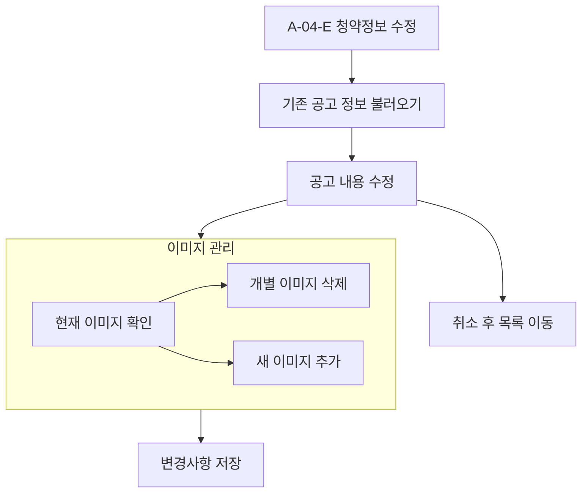
```mermaid
%%{init: {"themeVariables": {"fontSize": "19px"}, "flowchart": {"nodeSpacing": 45, "rankSpacing": 45}}}%%
flowchart TB
    TITLE[A-04-E 청약정보 수정]
    LOAD[기존 공고 정보 불러오기]
    FORM[공고 내용 수정]

    subgraph IMAGE[이미지 관리]
        CURRENT[현재 이미지 확인]
        REMOVE[개별 이미지 삭제]
        ADD[새 이미지 추가]
        CURRENT --> REMOVE
        CURRENT --> ADD
    end

    SAVE[변경사항 저장]
    CANCEL[취소 후 목록 이동]

    TITLE --> LOAD --> FORM --> IMAGE
    IMAGE --> SAVE
    FORM --> CANCEL
```

- 기존 데이터를 입력폼 기본값으로 표시한다.
- 제목, 주택명, 면적, 인원, 주소, 금액, 기간, 설명, 원문 URL을 수정한다.
- 현재 이미지 목록을 확인하고 개별 삭제 또는 새 이미지 추가를 수행한다.
- 저장 시 `PUT /admin/listings/update/{id}` 또는 이미지 교체 API를 호출한다.
- 취소 시 목록과 기존 페이지로 돌아간다.

#### A-04-D. 삭제 확인

**화면 구성:**

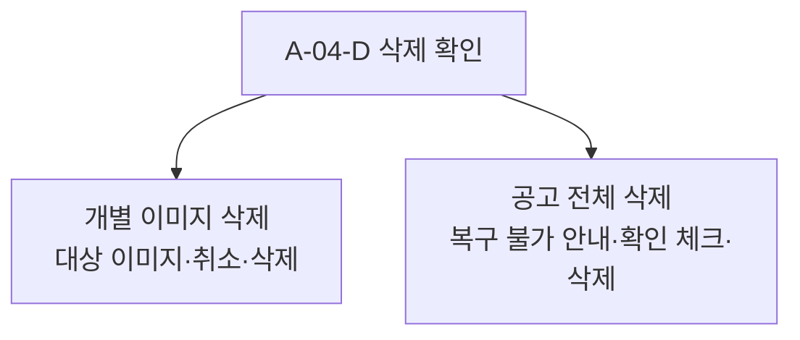
```mermaid
%%{init: {"themeVariables": {"fontSize": "19px"}, "flowchart": {"nodeSpacing": 45, "rankSpacing": 45}}}%%
flowchart TB
    TITLE[A-04-D 삭제 확인]
    IMAGE[개별 이미지 삭제<br/>대상 이미지·취소·삭제]
    LISTING[공고 전체 삭제<br/>복구 불가 안내·확인 체크·삭제]

    TITLE --> IMAGE
    TITLE --> LISTING
```

- 개별 이미지: 팝업에서 대상 이미지를 보여주고 취소/삭제를 선택한다.
- 공고 전체: 삭제 영역을 펼친 후 확인 체크박스를 선택해야 삭제 버튼이 활성화된다.
- 두 삭제 모두 복구할 수 없음을 사전에 표시한다.

### A-05. 즐겨찾기 순위

**화면 구성:**

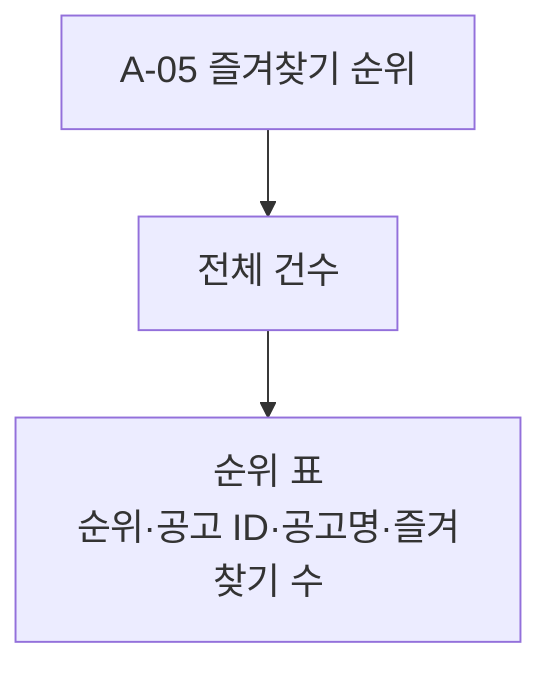
```mermaid
%%{init: {"themeVariables": {"fontSize": "19px"}, "flowchart": {"nodeSpacing": 45, "rankSpacing": 45}}}%%
flowchart TB
    TITLE[A-05 즐겨찾기 순위]
    COUNT[전체 건수]
    TABLE[순위 표<br/>순위·공고 ID·공고명·즐겨찾기 수]

    TITLE --> COUNT --> TABLE
```

- 진입 시 `GET /admin/favorites/ranking`을 호출한다.
- 데이터가 없으면 빈 데이터 안내를 표시한다.
- API 실패 시 오류 메시지를 표시한다.

### A-06. 즐겨찾기 상세

**화면 구성:**

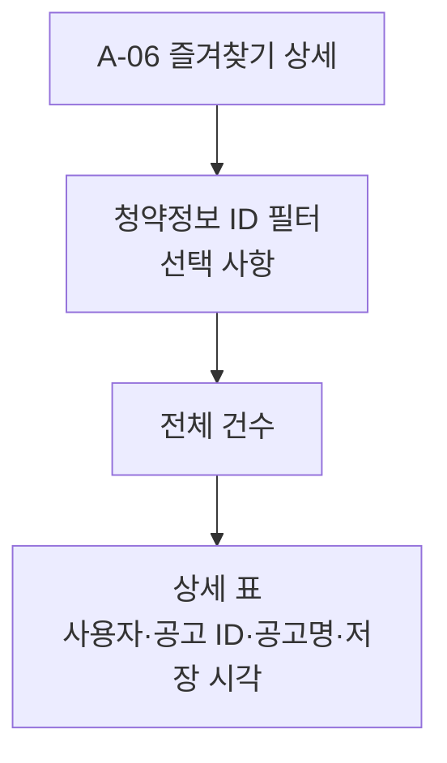
```mermaid
%%{init: {"themeVariables": {"fontSize": "19px"}, "flowchart": {"nodeSpacing": 45, "rankSpacing": 45}}}%%
flowchart TB
    TITLE[A-06 즐겨찾기 상세]
    FILTER[청약정보 ID 필터<br/>선택 사항]
    COUNT[전체 건수]
    TABLE[상세 표<br/>사용자·공고 ID·공고명·저장 시각]

    TITLE --> FILTER --> COUNT --> TABLE
```

| 사용자 액션 | API/상태 변화 | 피드백 |
| --- | --- | --- |
| 필터 없이 진입 | `GET /admin/favorites/detail` | 전체 내역 표 |
| 숫자 ID 입력 | `GET /admin/favorites/detail?listing_id=` | 해당 공고 내역 표 |
| 잘못된 ID 입력 | API 호출하지 않음 | 숫자 입력 오류 |

### A-07. 실시간 로그 대시보드

**관리자 목적:** 최근 서비스 로그와 레벨별 발생량을 준실시간으로 확인한다.

**화면 구성:**

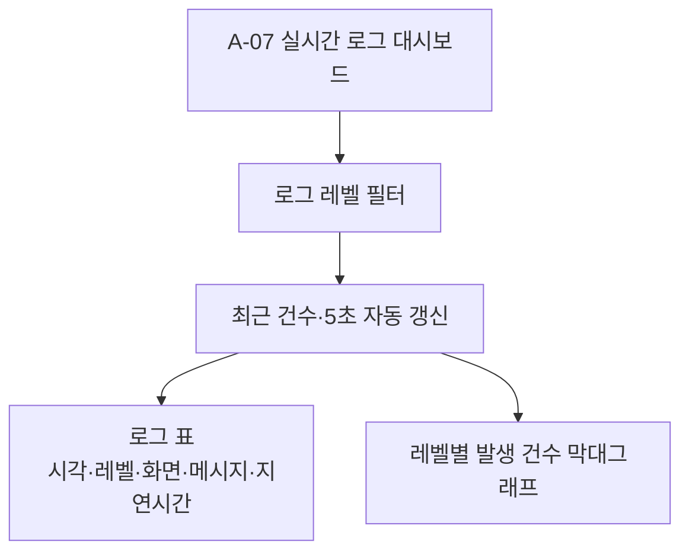
```mermaid
%%{init: {"themeVariables": {"fontSize": "19px"}, "flowchart": {"nodeSpacing": 45, "rankSpacing": 45}}}%%
flowchart TB
    TITLE[A-07 실시간 로그 대시보드]
    FILTER[로그 레벨 필터]
    REFRESH[최근 건수·5초 자동 갱신]
    TABLE[로그 표<br/>시각·레벨·화면·메시지·지연시간]
    CHART[레벨별 발생 건수 막대그래프]

    TITLE --> FILTER --> REFRESH
    REFRESH --> TABLE
    REFRESH --> CHART
```

| 사용자 액션 | API/상태 변화 | 피드백 |
| --- | --- | --- |
| 화면 진입 | `GET /logs?level=&limit=50` | 최근 로그 표·차트 |
| 레벨 변경 | 선택한 레벨로 재조회 | 필터링된 결과 |
| 5초 경과 | `st.fragment`가 자동 재실행 | 최근 건수와 표·차트 갱신 |
| 로그 없음 | 차트 생성 안 함 | “아직 로그가 없습니다” |
| API 실패 | 현재 갱신 중단 | 오류 메시지 |

### A-08. 로그 이력 조회

**화면 구성:**

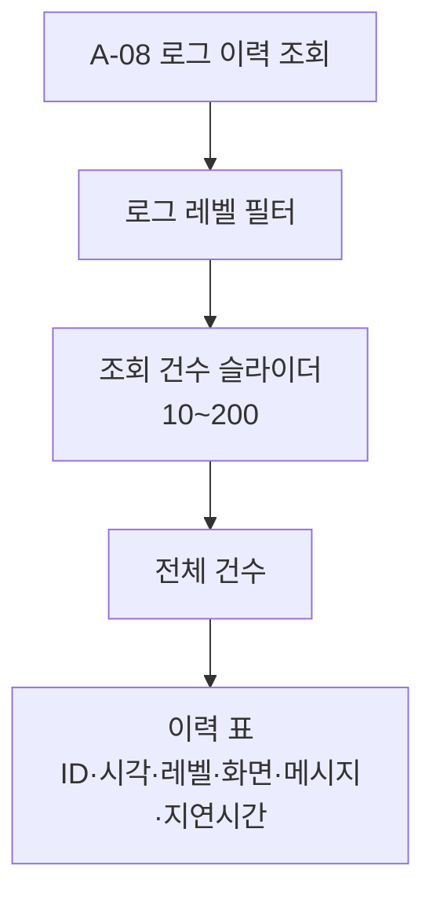
```mermaid
%%{init: {"themeVariables": {"fontSize": "19px"}, "flowchart": {"nodeSpacing": 45, "rankSpacing": 45}}}%%
flowchart TB
    TITLE[A-08 로그 이력 조회]
    FILTER[로그 레벨 필터]
    LIMIT[조회 건수 슬라이더<br/>10~200]
    COUNT[전체 건수]
    TABLE[이력 표<br/>ID·시각·레벨·화면·메시지·지연시간]

    TITLE --> FILTER --> LIMIT --> COUNT --> TABLE
```

- `GET /logs/history?level=&limit=`으로 DB에 저장된 warning/error를 조회한다.
- 레벨 선택과 조회 건수 슬라이더 변경 시 다시 조회한다.
- 결과가 없으면 빈 데이터 안내, 실패하면 API 오류를 표시한다.

---

## 9. 화면-API 연결 요약

| 화면 | Method | Endpoint | 목적 |
| --- | --- | --- | --- |
| U-04 | GET | `/listings/getall` | 전체 공고 조회·정렬 |
| U-04, A-04 | GET | `/listings/search` | 조건검색 |
| A-04 | GET | `/listings/page` | 관리자 페이지 단위 조회 |
| U-04 | POST | `/favorites/create` | 즐겨찾기 등록 |
| U-05 | GET | `/favorites/mypage/{user_id}` | 즐겨찾기 목록 |
| U-05 | DELETE | `/favorites/delete/{user_id}/{listing_id}` | 즐겨찾기 삭제 |
| U-06 | GET/PUT | `/profiles/{user_id}` | 프로필 조회·수정 |
| U-07 | GET | `/locations/geocode` | 주소 좌표 변환 |
| U-07 | GET | `/locations/nearby-facilities` | 주변 시설 통합 조회 |
| A-02 | POST | `/admin/login` | 관리자 로그인 |
| A-03 | POST | `/admin/listings/create` | 공고 등록 |
| A-03 | POST | `/admin/listings/images/bulk` | 다중 이미지 업로드 |
| A-04-E | PUT | `/admin/listings/{listing_id}/images` | 기존 이미지 유지·교체 |
| A-04-D | DELETE | `/admin/listings/{listing_id}/image` | 개별 이미지 삭제 |
| A-04-E | PUT | `/admin/listings/update/{listing_id}` | 공고 수정 |
| A-04-D | DELETE | `/admin/listings/delete/{listing_id}` | 공고 삭제 |
| A-05 | GET | `/admin/favorites/ranking` | 즐겨찾기 순위 |
| A-06 | GET | `/admin/favorites/detail` | 즐겨찾기 상세 |
| A-07 | GET | `/logs` | 메모리의 최근 로그 |
| A-08 | GET | `/logs/history` | DB의 warning/error 이력 |

> 사용자 회원가입·로그인·비밀번호 변경은 FastAPI가 아니라 FE_User에서 Supabase Auth SDK를 직접 호출한다.

---

## 10. 핵심 사용자 흐름과 발표 시연 순서

### 10.1 일반 사용자 흐름

```mermaid
%%{init: {"themeVariables": {"fontSize": "19px"}, "flowchart": {"nodeSpacing": 45, "rankSpacing": 45}}}%%
flowchart TB
    H[홈] --> S[회원가입]
    S --> L[로그인]
    L --> Q[청약정보 검색]
    Q --> F[즐겨찾기 추가]
    F --> M[즐겨찾기 목록·지도]
    Q --> N[주변생활권 분석]
    L --> P[프로필 수정]
```

### 10.2 관리자 흐름

```mermaid
%%{init: {"themeVariables": {"fontSize": "19px"}, "flowchart": {"nodeSpacing": 45, "rankSpacing": 45}}}%%
flowchart TB
    AL[관리자 로그인] --> C[공고 등록]
    C --> R[공고 조회]
    R --> E[공고·이미지 수정]
    R --> D[공고 삭제]
    AL --> FR[즐겨찾기 순위·상세]
    AL --> LD[실시간 로그]
    LD --> LH[경고·오류 이력]
```

### 10.3 권장 시연 순서

1. 관리자 로그인 후 이미지가 포함된 청약 공고를 등록한다.
2. 사용자 청약정보 조회에서 등록된 공고를 검색한다.
3. 상세정보와 여러 이미지를 확인하고 즐겨찾기에 추가한다.
4. 즐겨찾기 목록과 지도에서 저장 결과를 확인한다.
5. 주변생활권 분석에서 공고를 선택하고 시설 지도와 상세 팝업을 확인한다.
6. 관리자 즐겨찾기 순위에서 사용자의 행동이 집계됐는지 확인한다.
7. 로그 대시보드의 5초 자동 갱신과 warning/error 이력을 확인한다.

---

## 11. 상태 및 예외 설계

| 상태 | 공통 표시 원칙 | 적용 화면 |
| --- | --- | --- |
| 로딩 | 스피너와 수행 중인 작업 문구 | 공고·프로필·위치·로그 조회 |
| 빈 데이터 | 빈 영역 대신 이유를 설명하는 정보 메시지 | 공고, 즐겨찾기, 통계, 로그 |
| 입력 오류 | API 호출 전에 항목 가까이에 명확한 문구 표시 | 로그인, 회원가입, 공고 등록·수정 |
| 인증 필요 | 경고 후 화면 실행 중단 또는 로그인 이동 | 사용자 개인 화면, 관리자 보호 화면 |
| API 오류 | 백엔드 오류 메시지 표시, 기존 입력은 가능한 한 유지 | 모든 API 연동 화면 |
| 세션 만료 | 브라우저 토큰 제거 후 재로그인 안내 | 사용자 앱 공통 |
| 외부 API 오류 | 주소·좌표·시설을 찾지 못한 이유 표시 | 즐겨찾기 지도, 생활권 분석 |
| 파괴적 액션 | 복구 불가 경고와 추가 확인 절차 | 관리자 공고·이미지 삭제 |

---

## 12. 반응형·접근성 점검 기준

- 데스크톱에서는 사이드바와 넓은 본문 레이아웃을 사용한다.
- 작은 화면에서 `st.columns`가 세로로 쌓일 때 정보 순서가 제목 → 내용 → 액션 순서를 유지해야 한다.
- 이미지에는 공고명 기반 대체 설명을 제공하는 방향을 권장한다.
- 버튼은 “확인”보다 “즐겨찾기 삭제”, “청약정보 등록”처럼 결과가 드러나는 문구를 사용한다.
- 비밀번호 입력은 항상 마스킹한다.
- 표와 차트는 제목, 건수, 필터 조건을 함께 표시한다.
- 지도 정보는 아이콘뿐 아니라 하단 범례와 툴팁 텍스트로도 구분한다.
- 오류는 색상과 함께 문장으로 설명한다.

---

## 13. 구현 대조 결과 및 최종 캡처 전 점검

화면설계서와 실제 구현을 최종 일치시키기 위해 다음 항목을 먼저 점검해야 한다.

1. `FE_User/app_pages/05_favorite.py`에 중복 import와 지도 렌더링 코드가 함께 남아 있다. 현재 코드에는 `points = tuple[float, float]` 뒤에 `append`를 호출하는 흐름과 중복 함수 import가 있어 즐겨찾기 지도 화면의 실제 실행 검증이 필요하다.
2. `FE_User/app_pages/00_login.py`에서 이메일 도메인 “직접 입력” 선택 시 별도 입력창 대신 문자열 “직접 입력”이 사용된다. U-02 설계대로 도메인 입력창이 나타나도록 구현을 맞춰야 한다.
3. 사용자 `app.py`의 페이지 제목, 배열 쉼표 간격 등 경미한 스타일을 정리하면 유지보수가 쉬워진다.
4. 관리자 Session Storage는 현재 편의상 로그인 화면 상태만 복원하며 서버 측 인증 수단이 아니다. 외부 배포 전 관리자 API 인증을 보강해야 한다.
5. `U-05 즐겨찾기 목록`과 `U-07 주변생활권 분석`은 실제 Kakao API 키가 설정된 배포 환경에서 최종 캡처한다.
6. 정상 화면뿐 아니라 빈 데이터, 입력 오류, API 오류 화면도 최소 한 장씩 검증한다.

---

## 14. 산출물 체크리스트

- [x] 사용자·관리자 전체 화면 목록
- [x] 메인·상세·입력·관리·오류 화면 와이어프레임
- [x] 정보구조와 화면 이동 흐름
- [x] 입력, 버튼, 표, 차트, 지도 구성
- [x] 클릭, 필터, 페이지 이동, 호버, 자동 새로고침 액션
- [x] 액션별 API와 상태 변화
- [x] 성공, 빈 데이터, 인증, 입력, API 오류 피드백
- [ ] 실제 배포 화면 캡처 삽입
- [ ] U-05와 U-02 구현 불일치 수정 후 최종 검증
- [ ] 발표용 핵심 화면 6~8장 선정
